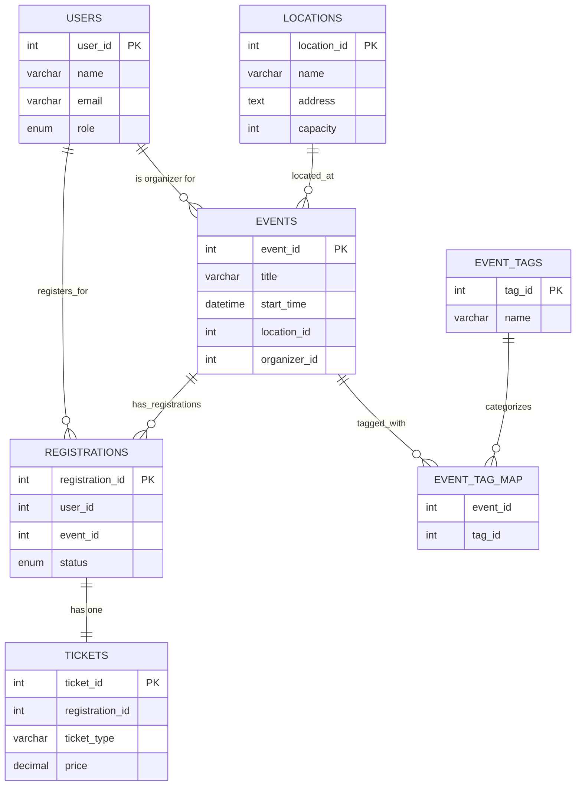

# College Event Management System

This project is a comprehensive, console-based application for managing college events, developed as a capstone project for the completion of the Java Full Stack course at the **Anudip Foundation**.

The system provides distinct functionalities for two types of users: **Organizers**, who can create and manage events, and **Attendees**, who can discover and register for them. The application is built using Java and leverages the Hibernate framework for Object-Relational Mapping (ORM) to interact with a relational database.

## 🎯 Project Goal

The primary objective of this project is to apply and demonstrate proficiency in building a data-centric application using Hibernate. It fulfills the course requirement of creating a real-world software project that involves database design, proper coding conventions, and thorough documentation, all while following a structured development lifecycle.

## ✨ Key Features

*   **Role-Based Access Control:** Separate dashboards and functionalities for 'Organizer' and 'Attendee' roles.
*   **Event Management:** Organizers can create, update, delete, and view events.
*   **Location Management:** Organizers can add and manage event venues, including address and capacity.
*   **Attendee Registration:** Attendees can view all events, register for them, and cancel their registrations.
*   **Capacity Control:** The system is designed to check location capacity before confirming a registration.
*   **Centralized Database:** Uses a relational database (like MySQL or PostgreSQL) to persist all data.
*   **ORM with Hibernate:** All database operations are handled efficiently through Hibernate's Session and HQL queries.

## 🛠️ Technology Stack

*   **Core Language:** Java 11+
*   **Build Tool:** Apache Maven
*   **ORM Framework:** Hibernate
*   **Database:** MySQL / PostgreSQL
*   **IDE:** IntelliJ IDEA / Eclipse

## 🗄️ Database Design

The database is normalized to reduce redundancy and ensure data integrity. The design centers around users, events, locations, and the registrations that link them together.

### Entity Relationship Diagram (ERD)




### Table Schemas

#### 1. `users`
Stores information about both attendees and organizers.
```sql
CREATE TABLE users (
    user_id       INT PRIMARY KEY AUTO_INCREMENT,
    name          VARCHAR(100),
    email         VARCHAR(100) UNIQUE,
    password_hash VARCHAR(255), -- Should be a securely hashed password
    role          ENUM('attendee', 'organizer') NOT NULL
);
```


#### 2. `locations`
Stores details about the event venues.
```sql
CREATE TABLE locations (
    location_id  INT PRIMARY KEY AUTO_INCREMENT,
    name         VARCHAR(255),
    address      TEXT,
    capacity     INT
);
```


#### 3. `events`
The core table containing event details, linked to a location and an organizer.
```sql
CREATE TABLE events (
    event_id     INT PRIMARY KEY AUTO_INCREMENT,
    title        VARCHAR(255),
    description  TEXT,
    start_time   DATETIME,
    end_time     DATETIME,
    location_id  INT,
    organizer_id INT,
    FOREIGN KEY (location_id) REFERENCES locations(location_id),
    FOREIGN KEY (organizer_id) REFERENCES users(user_id)
);
```


#### 4. `registrations`
A mapping table that tracks which user has registered for which event.
```sql
CREATE TABLE registrations (
    registration_id INT PRIMARY KEY AUTO_INCREMENT,
    user_id         INT,
    event_id        INT,
    registered_at   DATETIME DEFAULT CURRENT_TIMESTAMP,
    status          ENUM('confirmed', 'cancelled', 'waitlisted'),
    FOREIGN KEY (user_id) REFERENCES users(user_id),
    FOREIGN KEY (event_id) REFERENCES events(event_id),
    UNIQUE (user_id, event_id) -- A user can only register for an event once
);
```


---

## 🔁 User Flows

The application logic follows these user flows based on the authenticated user's role.

### 1. 🔐 Login / Register

*   **Prompt:** `1. Login 2. Register 3. Exit`
*   **Login:** Authenticates against the `users` table.
*   **Register:** Inserts a new user with the default role of `attendee`.
*   After a successful login, the system directs the user to the appropriate dashboard based on their role.

### 2. 👨‍💼 Organizer Flow (`role` = 'organizer')
```
--- ORGANIZER DASHBOARD ---
1. Create Event
2. View My Events
3. View All Events
4. Update Event
5. Delete Event
6. View Registered Attendees for Event
7. View All Locations
8. Add Location
9. Logout
```

*   **Create Event:** Prompts for event details and links to a location and the current organizer.
*   **View My Events:** Shows only the events created by the currently logged-in organizer.
*   **Update/Delete Event:** Allows modification or removal of an event, but only if the current user is the organizer.
*   **View Registered Attendees:** Lists all users confirmed for a specific event.
*   **Add/View Locations:** Allows the organizer to manage the list of available venues.

### 3. 🎓 Attendee Flow (`role` = 'attendee')
```
--- ATTENDEE DASHBOARD ---
1. View All Events
2. Register for Event
3. Cancel Registration
4. View My Registered Events
5. Logout
```

*   **View All Events:** Shows a list of all upcoming events with venue details.
*   **Register for Event:** Allows a user to register for an event. The system checks for venue capacity and prevents duplicate registrations.
*   **Cancel Registration:** Allows a user to remove their registration from an event.
*   **View My Registered Events:** Shows a list of all events the user is currently registered for.

---

## 📂 Project Structure

The project follows the standard Maven directory layout. The source code is organized into packages based on functionality.

```
src
└── main
    ├── java
    │   └── com
    │       └── college
    │           └── event
    │               ├── dao         # Data Access Objects (for DB operations)
    │               ├── entity      # Hibernate entity classes (maps to tables)
    │               ├── main        # Main application entry point
    │               └── util        # Utility classes (e.g., HibernateUtil)
    └── resources
        └── hibernate.cfg.xml       # Hibernate configuration file
pom.xml                             # Maven project configuration
README.md                           # This documentation file
```


## 🚀 How to Run the Application

### Prerequisites
*   Java Development Kit (JDK) 11 or higher
*   Apache Maven
*   A running instance of MySQL or PostgreSQL database server.

### Steps
1.  **Clone the Repository**
```shell script
git clone https://github.com/Acinnamon9/Event-Management.git
    cd Event-Management
```


2.  **Database Setup**
    *   Create a new database (e.g., `college_event_db`).
    *   Run the SQL scripts provided in the `database/` directory (or the schemas in this README) to create the tables.

3.  **Configure Hibernate**
    *   Open `src/main/resources/hibernate.cfg.xml`.
    *   Update the database connection properties (URL, username, password) to match your database setup.

4.  **Build and Run**
    *   Use Maven to compile the project and run the application.
        *```shell script
        mvn clean install
        mvn exec:java -Dexec.mainClass="com.college.event.main.Main"
```

    *   The application will start in your console.

---
